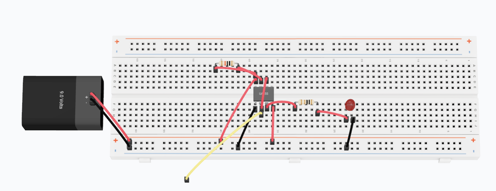

# 24 — Touch Sensor Switch

**Simulator:** WithDiode  
**Difficulty:** Beginner  
**Components:** NE555, 1kΩ resistor, 10kΩ resistor, LED, jumper wire (touch wire)

---

## What it does
Toggles an LED on and off when a person touches a bare wire no button, 
no mechanical switch, just a finger.

---

## Concept
The human body has a natural stray capacitance to Earth ground (~100pF). 
The 50Hz AC electric field that permanently permeates any room (from wall 
wiring, power supplies etc.) constantly induces a small AC voltage on your 
body. When you touch the bare wire, your body becomes electrically coupled 
to Pin 2 of the NE555 via this natural capacitance.

This is a capacitive touch switch no dedicated touch IC, just the body 
acting as a capacitive coupler.

---

## How it works

**Turning ON:**
- You touch the wire → your body capacitance connects to Pin 2
- On the negative half-cycle of the 50Hz noise, Pin 2 momentarily drops 
  below ~1/3 Vcc (~3V)
- This triggers the 555's internal comparator → Pin 3 output goes HIGH (~8V)
- LED switches ON

**Turning OFF:**
- You touch the wire again
- On the positive half-cycle of the 50Hz noise, Pin 2 momentarily rises 
  above ~2/3 Vcc (~6V)
- This resets the 555 → Pin 3 output goes LOW (~0V)
- LED switches OFF

The 10kΩ resistor connects Pin 7 and Pin 8 (discharge and reset). 
The 1kΩ resistor is the current limiting resistor for the LED on Pin 3.

---

## Circuit

[Open in WithDiode](https://www.withdiode.com/projects/e5b07b68-0233-43f5-9667-147628488150)

---

## Key insight
This circuit exploits something that exists in every room mains 
interference and turns it into a useful signal. The 555 timer is wired 
in bistable (SR latch) mode, not the usual astable or monostable 
configuration, which is what allows it to toggle and hold state.

---

## What I observed / tried
- Works better indoors near electrical wiring (stronger 50Hz field)
- Touching the wire with a glove reduces sensitivity (less capacitive coupling)
- Longer touch wire = more sensitive (larger antenna area)
