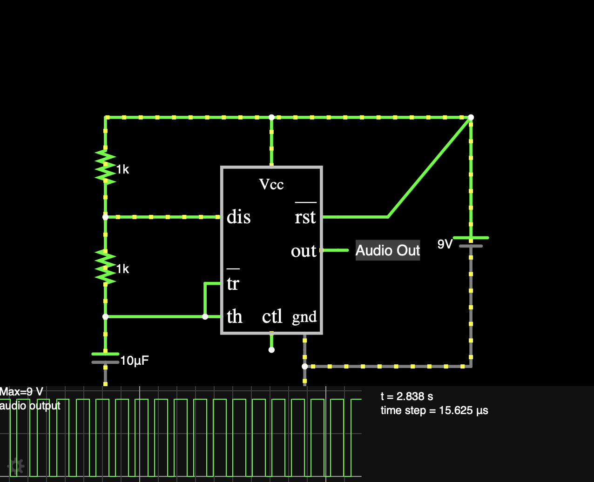
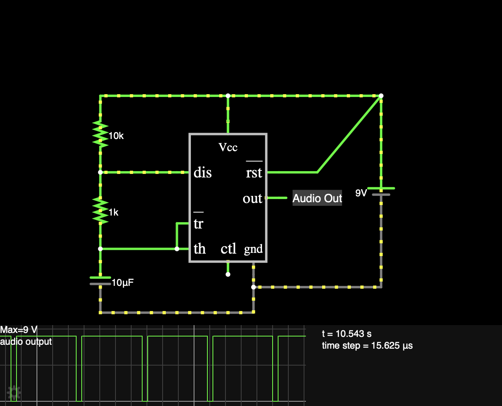
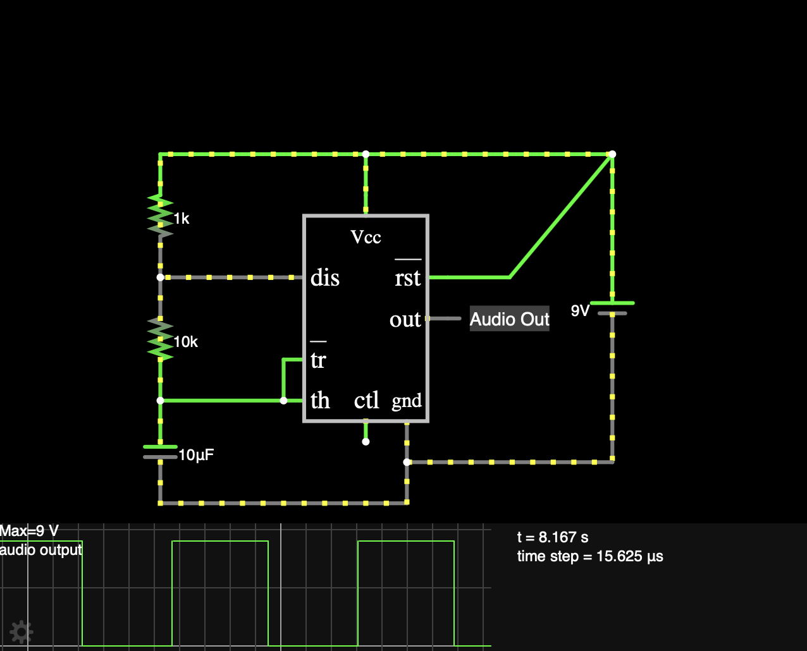

# 37 — Tone Generator

**Simulator:** Falstad  
**Difficulty:** Beginner  
**Components:** NE555 timer IC, 10kΩ resistor (R1), 1kΩ resistor (R2), speaker/audio output

---

## What it does
A 555 timer continuously switches its output between HIGH and LOW, creating a square wave. When this drives a speaker, the switching frequency becomes audible pitch. Change the resistors, change the tone.

---

## Concept
The NE555 in astable mode produces a continuous square wave whose frequency and duty cycle are controlled by two resistors. This square wave directly drives a speaker, making the electrical behavior audible changing resistor values changes the tone you hear.

R1 controls only the HIGH time.
R2 controls both HIGH and LOW time.
This asymmetry means the circuit can never achieve a 50% duty cycle 
in standard configuration.

---

## How it works
After making the appropriate connections, the two resistors thus, behave as knobs to control the output signal, to test this several observations were made as follows:

**Case - 1: Both resistors set to 1kΩ.**

In this case the audio signal when heard seems to be a one continous sound, although the time for both highs and lows is very small, it is because of something called temporal resolution, that we are unable to distinguish the lows, and hence what are actual beats, we hear them as a persistent sound.

**Case - 2: Top resistor set to 10kΩ & bottom set to 1kΩ.**

In this case since, the top resistor value is increased, the time for highs in teh graph increases, or basically the highs braoden, now one may think that since the highs have broadend, we may listen a more continous sound just like in the first case, but here's the catch, increasing the value of resistor also increases the time period or reduces the frequency, meaning the number of cycles happening per second also reduces, because of which the lows actually become audible as they still take up some amount of the running time we hear. This is completely different from how case-1 works.

**Case - 3: Top resistor set to 1kΩ & bottom set to 10kΩ.**

In this case, since the bottom one is increased, it reduces the time for highs and increases the time for lows, thus logically making sense of why? this should actually sound like a beat and it surely does. But, then what is the difference between teh audio output of thsi case and the one before this, the difference is very subtle but noteworthy, since the time for lows is increased in this case, the audio output has beats which rest longer than the one in the previous case, which feels like the frequency of beats has reduced, this is what makes it different from teh previous case.

---

## What I learnt?

Changing resistor values doesn't just reshape the square wave it changes what you hear, and whether you can hear the difference at all.

**I HAVE ALSO ADDED THE .txt FILE WHICH YOU CAN DOWNLOAD AND IMPORT IN FALSTAD**
